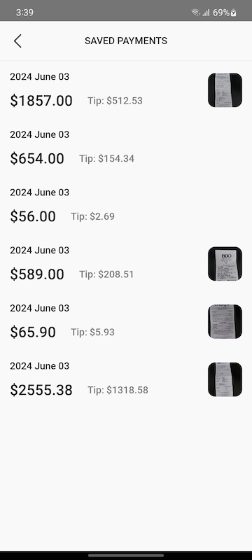
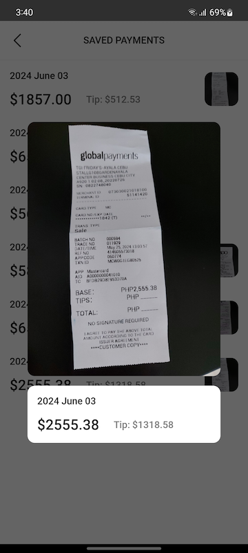
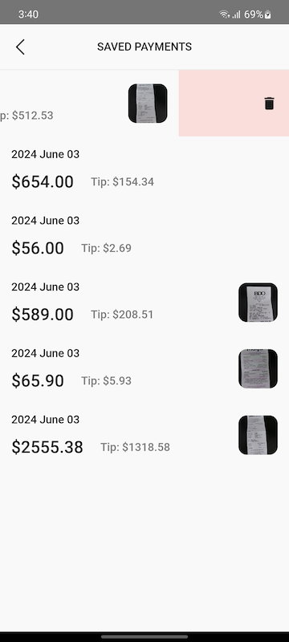
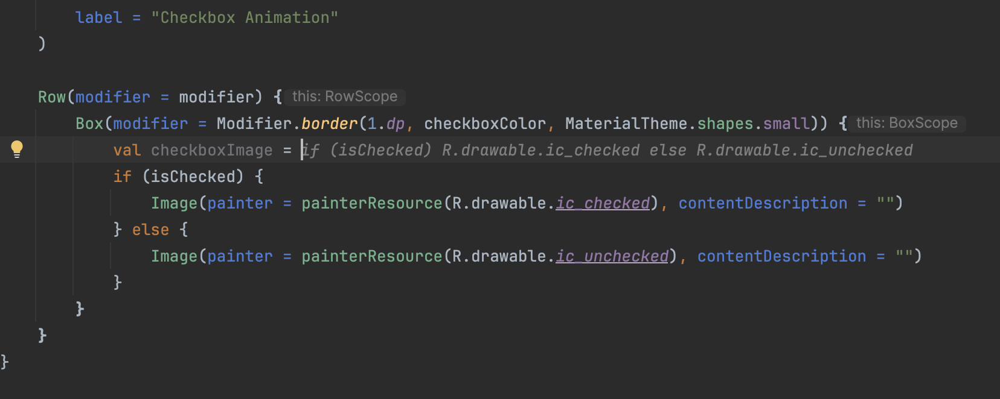
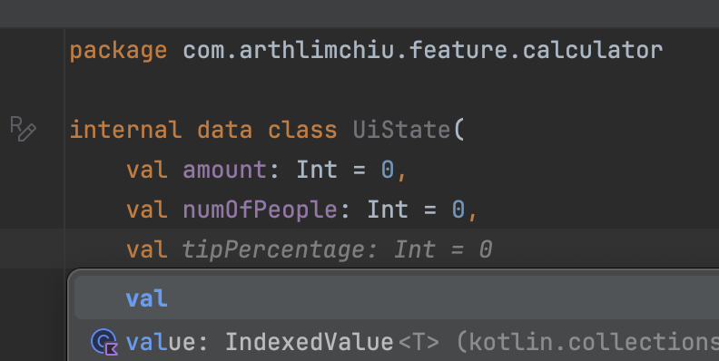
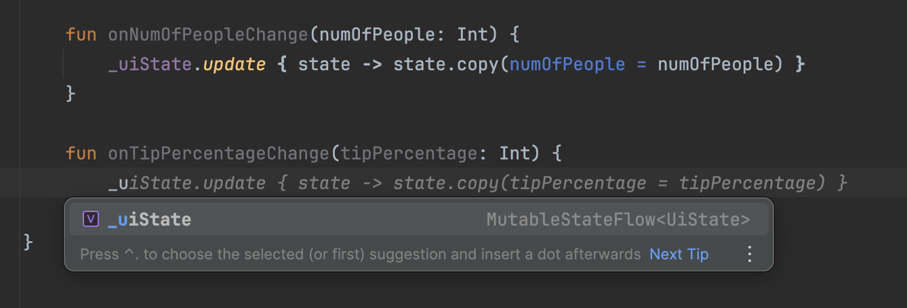
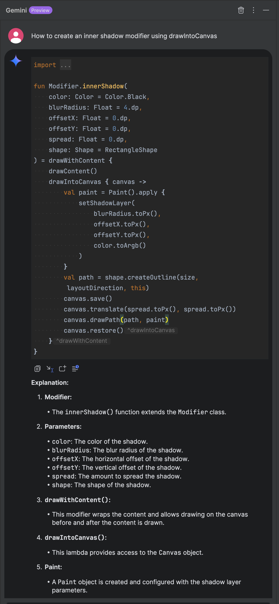
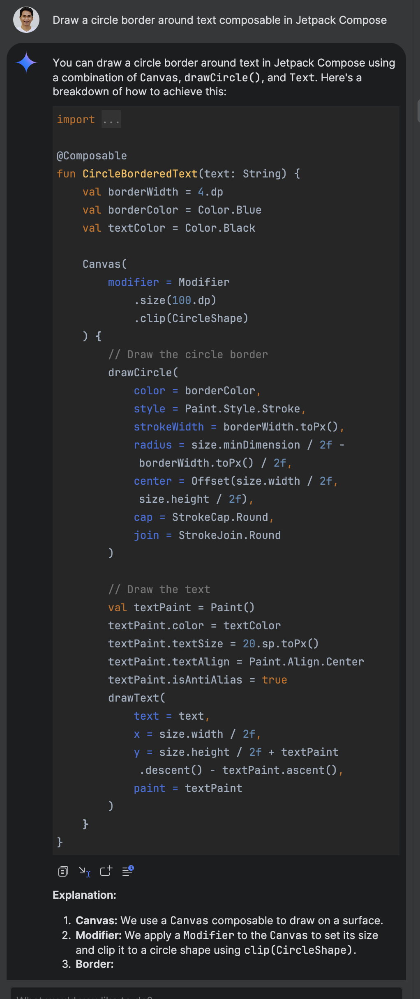
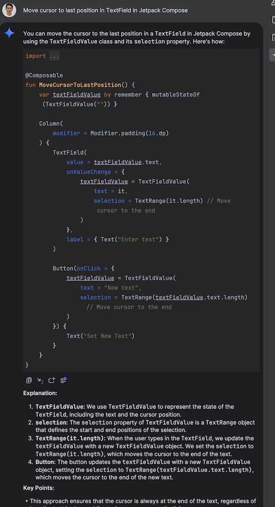
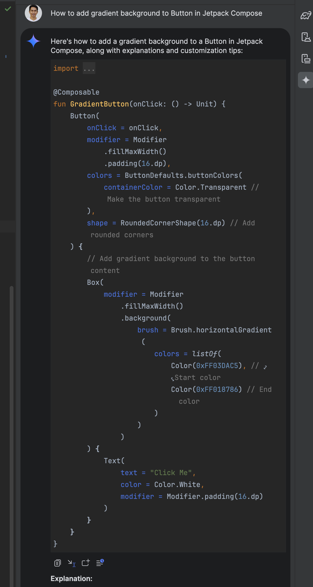

# TipJar

A tip calculator app which showcases Jetpack Compose, Compose Navigation, Multi-Module Modularization, and MVVM Architecture

## Screenshots

## Using AI to Improve My Workflow

### AI-Based Code Completion

Using Gemini's AI-based inline code completions (Settings -> Tools -> Gemini), I'm able to autocomplete blocks of code which speeds up my workflow.

Using this tool as a foundation of my workflow allows me to complete large blocks of code and just do some minor revisions.

### Heavy Usage

The part where I used AI heavily the most is using Gemini, Android Studio's newest AI coding companion.

I'm able to ask questions and it's able to come up with answers in the **context** of my project.

#### Gemini Expectations

If you're using it expecting it to be 100% accurate then you might have a hard time. There are times where the methods/functions suggested doesn't exist.

If you're asking for large blocks of code, don't just copy and paste. As it might not run as you expected.

Where it helps is to come up with blocks of code and then pick some parts of it or gain an understanding based from the answer (aha moments).

I see this tool as an **extension** of your skillset and **NOT** as a replacement. You will find value in this tool if you have knowledge/experience about Android Development and you're familiar with navigating the documentation and API references to cross-check the answers provided by Gemini or come up with your own answers faster than not having something to start with.

### Heavy Usage #1
Creating a custom inner shadow modifier for the custom textfields in the calculator screen.

### Heavy Usage #2
Creating a circle background instead of a circle border so that the shape will not expand. Used this on the plus(+) and minus(-) buttons in the "How many people?" section.

### Heavy Usage #3
Used what I found in this Gemini answer to further improve the text field experience in Calculator screen especially when it's formatted behind the scenes.

### Heavy Usage #4
Used this answer to understand how gradient is created in Jetpack Compose and applied to the orange button in Calculator screen.

